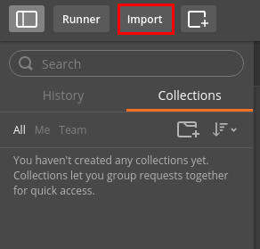
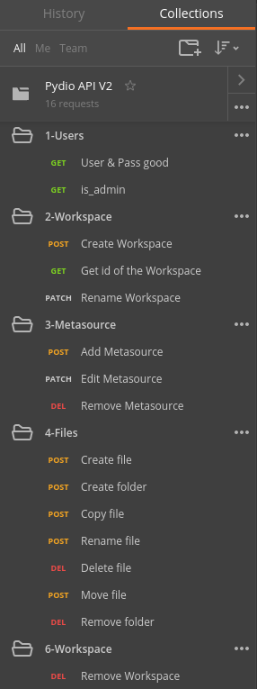
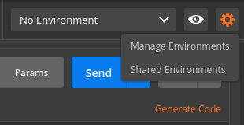
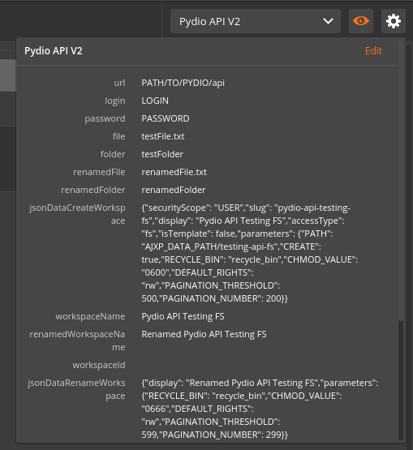
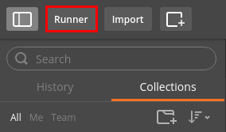
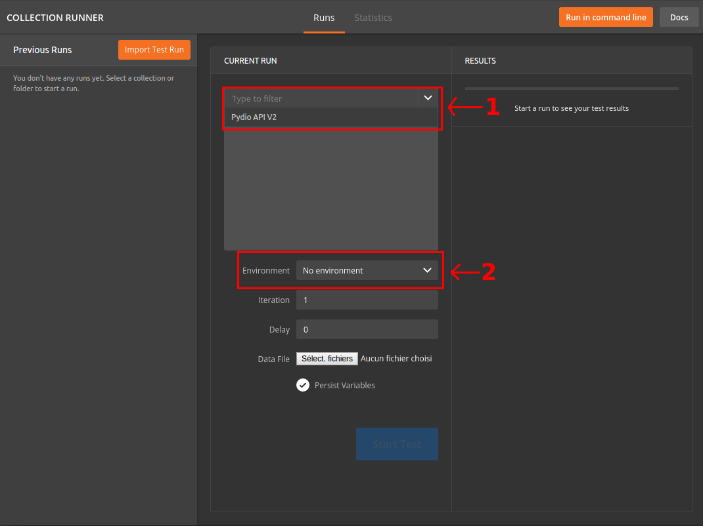
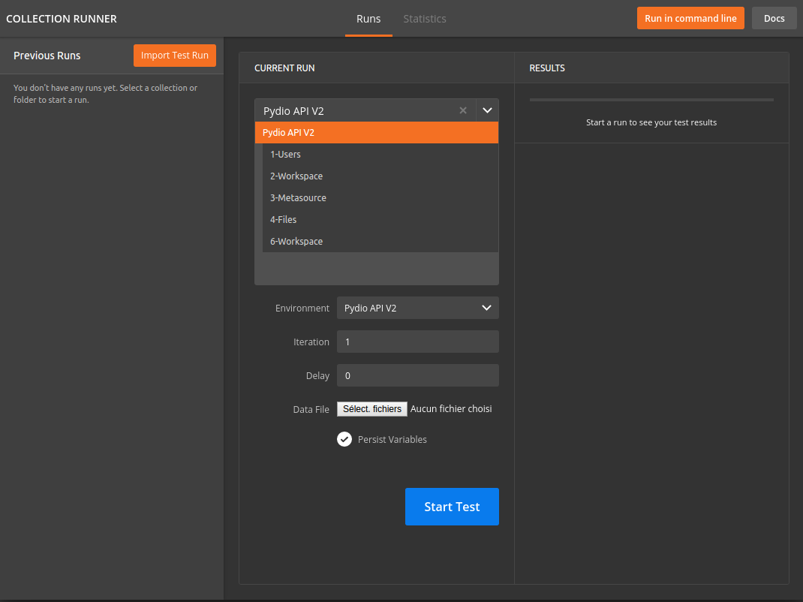

#Pydio API Testing

##What is it ?
Pydio API Testing is two files to test your Pydio's API (currently V2) with [Postman](https://www.getpostman.com/) or [Newman](https://www.npmjs.com/package/newman)
##Disclaimer
Before start testing you must have an installed Pydio. If you don't know how to install one, you can check this [guide](https://pydio.com/en/docs/v6/install-pydio).
After the installation, you need to change 3 values in `Pydio.postman_environment.json` who's the url of your Pydio and your pydio user's credentials.
For exemple if your Pydio url is `http://192.168.0.68/pydio` and you login with admin/secret you must change this
```
{
      "key": "url",
      "value": "PATH/TO/PYDIO/api",
      "type": "text",
      "enabled": true
    },
    {
      "key": "login",
      "value": "LOGIN",
      "type": "text",
      "enabled": true
    },
    {
      "key": "password",
      "value": "PASSWORD",
      "type": "text",
      "enabled": true
    },
```
to this
```
{
      "key": "url",
      "value": "http://192.168.0.68/pydio/api",
      "type": "text",
      "enabled": true
    },
    {
      "key": "login",
      "value": "admin",
      "type": "text",
      "enabled": true
    },
    {
      "key": "password",
      "value": "secret",
      "type": "text",
      "enabled": true
    },
```
##How to use it ?
###With Postman
First you need to import the `Pydio.postman_collection.json` file as a Collection.
To do that, you must click to the `Import` button at the top left of Postman and choose the `Pydio.postman_collection.json` file.  

  

After the import you must see the collection like this  

  

We have the collection but we also need the `Pydio.postman_environment.json` file who's gonna be a Environment.
To do that, you must click to the wheel button and to `Manage environments` at the top right of Postman and choose the `Pydio.postman_environment.json` file.  

  

After the import you can see the environment if you click to the eye.  

  

Collection and environment file are imported, we can test our Pydio's API. Click to the `Runner` button at the top left of Postman.  

  

A second screen gonna appear and you need to select `Pydio API V2` as collection (in the 1) and `Pydio API V2` as an environment (in the 2).  

  

If you do that you must see this  

  

You can now start the test
###With Newman
First go to the folder where is `Pydio.postman_collection.json` and `Pydio.postman_environment.json` with a terminal.  
After that you need to write `newman -c Pydio.postman_collection.json -e Pydio.postman_environment.json` to start the test in command-line.